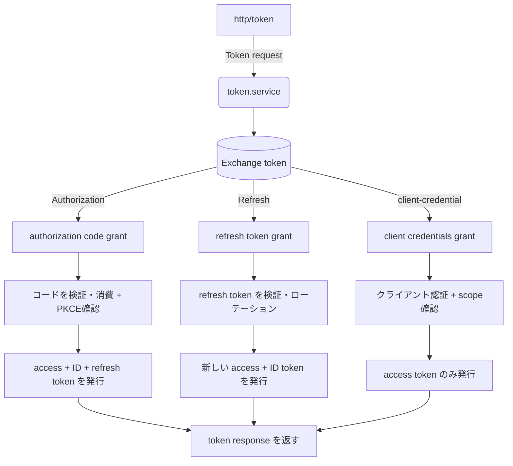

# Signing

```mermaid
flowchart TD
    A[http/token] -->|Token request| B(token.service)
    B --> C[(Exchange token)]
    C -->|Authorization| D[authorization code grant]
    C -->|Refresh| E[refresh token grant]
    C -->|client-credential| F[client credentials grant]

    D --> D1[コードを検証・消費 + PKCE確認]
D1 --> G[access + ID + refresh token を発行]

E --> E1[refresh token を検証・ローテーション]
E1 --> H[新しい access + ID token を発行]

F --> F1[クライアント認証 + scope確認]
F1 --> I[access token のみ発行]

G --> Z[token response を返す]
H --> Z
I --> Z
```
